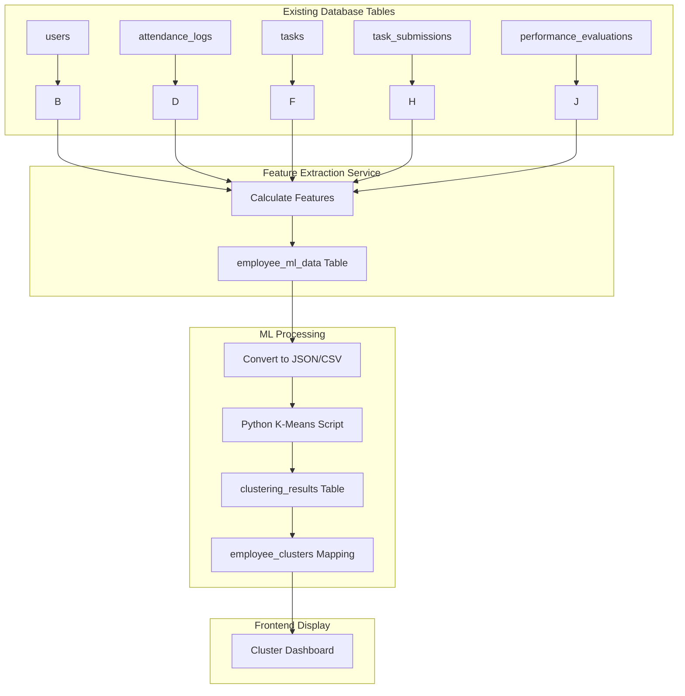

# 🚀 IMPLEMENTATION PLAN - K-MEANS CLUSTERING INTEGRATION
## SIM Kinerja PT Central Saga Mandala

---

## 📋 RINGKASAN EKSEKUTIF

**Tujuan:** Mengintegrasikan algoritma K-Means Clustering ke dalam sistem SIM Kinerja untuk mengelompokkan 30 karyawan berdasarkan kinerja dan beban kerja sebagai pendukung keputusan penugasan.

**Timeline Estimasi:** 4 Minggu (20 hari kerja)

**Teknologi:** Laravel 11 Backend + Next.js 14 Frontend + Python ML Service

**Data Target:** 30 karyawan dengan 8 variabel fitur performa

---

## 🎯 OBJECTIVES & SUCCESS CRITERIA

### Objectives
1. ✅ Implement K-Means clustering dengan 3 cluster optimal
2. ✅ Automate data extraction dari existing tables
3. ✅ Visualisasi hasil clustering untuk HR/Manager
4. ✅ Integration dengan workflow penugasan existing
5. ✅ Generate interpretable cluster analysis

### Success Metrics
- Silhouette Score ≥ 0.5
- Cluster interpretability validated by HR
- Response time < 5 detik untuk clustering process
- Zero data loss during feature extraction
- User acceptance from management team

---

## 💾 DATASET STRATEGY - DATA SOURCES INTEGRATION

### 📌 Overview
**Dataset K-Means TIDAK manual dibuat!** Semua data otomatis diambil dari sistem SIM Kinerja yang sudah ada (existing database).

**Prinsip:** `Data Existing → Feature Extraction → ML Processing → Cluster Results`

### 🗄️ Sumber Data Existing System

| No | Fitur Variabel | Tabel Sumber | Field Columns | Perhitungan |
|----|----------------|--------------|---------------|-------------|
| 1 | **Attendance %** | `attendance_logs` | user_id, date, status | `COUNT(status='present') / total_days_in_period * 100` |
| 2 | **Tasks Completed %** | `task_submissions` | user_id, status | `COUNT(status='completed') / COUNT(*) * 100` |
| 3 | **On Time %** | `task_submissions` | user_id, due_date, actual_date | `COUNT(actual_date <= due_date) / COUNT(*) * 100` |
| 4 | **Quality Score** | `performance_evaluations` | user_id, quality_score | `AVG(quality_score)` per period |
| 5 | **Discipline Score** | `performance_evaluations` | user_id, discipline_score | `AVG(discipline_score)` per period |
| 6 | **Active Tasks Count** | `tasks` | assigned_to, status | `COUNT(status IN ('assigned','in_progress'))` per employee |
| 7 | **Late Tasks Count** | `tasks` | assigned_to, status, due_date, actual_date | `COUNT(status='completed' AND actual_date > due_date)` |
| 8 | **Avg Resolution Days** | `task_submissions` | assigned_to, created_at, completed_at | `AVG(DATEDIFF(completed_at, assigned_at))` |

### 🔄 Data Flow Architecture



### 📁 Implementation Files Related to Data

#### **1. Migration - Create ML Storage Tables**
Location: `backend/database/migrations/XXXX_create_employee_ml_tables.php`
```php
Schema::create('employee_ml_data', function (Blueprint $table) {
    // Tempat penyimpanan fitur extracted dari existing tables
});

Schema::create('clustering_results', function (Blueprint $table) {
    // Simpan hasil centroid & silhouette score
});

Schema::create('employee_clusters', function (Blueprint $table) {
    // Mapping employee_id → cluster assignment
});
```

#### **2. Model - EmployeeMLData**
Location: `backend/app/Models/EmployeeMLData.php`
```php
public static function calculateForEmployee(int $userId, string $period): ?self
{
    // Extract all 8 features from existing tables
    // Return complete feature vector for K-Means input
}
```

#### **3. Repository - Data Collection**
Location: `backend/app/Repositories/Eloquent/EmployeeMLRepository.php`
```php
public function bulkCalculate(array $userIds, string $period): int
{
    // Loop through employees and extract features
    // Store in employee_ml_data table
}
```

#### **4. Python Scripts - Dataset Conversion**
Location: `backend/python/ml_processor.py`
```python
def load_data(self, data_path: str):
    # Load employee data from Laravel-generated JSON
    # Returns normalized numpy array for sklearn
```

### ⏰ Dataset Generation Schedule

| Schedule | Trigger | Action | Frequency |
|----------|---------|--------|-----------|
| **Nightly Cron Job** | Automated (Laravel Scheduler) | Collect + Process previous month data | Daily at midnight |
| **Manual Trigger** | Admin button click | Re-process specific period | On-demand |
| **Real-time** | Task completion event | Update individual metrics | Instant (but no re-cluster) |

**Recommended:** Nightly batch processing dengan cron job

#### Example Crontab Entry:
```bash
# Run every day at 00:00
0 0 * * * cd /path/to/project && php artisan ml:collect-data --period=YYYY-MM >> logs/ml.log 2>&1
```

### 🔧 Helper Functions for Feature Calculation

#### Attendance Percentage:
```php
$attendancePercentage = ($totalDays > 0) 
    ? ($presentDays / $totalDays) * 100 
    : 0;
```

#### Task Completion Rate:
```php
$totalTasks = $tasks->count();
$completedTasks = $tasks->where('status', 'completed')->count();
$completionRate = ($totalTasks > 0) ? ($completedTasks / $totalTasks) * 100 : 0;
```

#### On-Time Performance:
```php
$onTimeTasks = $tasks->whereRaw('actual_date <= due_date')->count();
$onTimeRate = ($totalTasks > 0) ? ($onTimeTasks / $totalTasks) * 100 : 0;
```

#### Average Quality Score:
```php
$qualityScore = PerformanceEvaluation::where('user_id', $userId)
    ->where('period', $period)
    ->avg('quality_score');
```

#### Active Tasks Count:
```php
$activeCount = Task::where('assigned_to', $userId)
    ->whereIn('status', ['assigned', 'in_progress'])
    ->count();
```

#### Late Tasks Count:
```php
$lateCount = Task::where('assigned_to', $userId)
    ->where('status', 'completed')
    ->where('actual_date', '>', DB::raw('due_date'))
    ->count();
```

#### Average Resolution Days:
```php
$avgDays = Task::where('assigned_to', $userId)
    ->whereNotNull('completed_at')
    ->where('status', 'completed')
    ->selectRaw('AVG(TIMESTAMPDIFF(day, assigned_at, completed_at)) as avg_days')
    ->value('avg_days');
```

### 📊 Sample Output Format (JSON)

File akan dihasilkan sebagai: `storage/app/ml_input_{timestamp}.json`

```json
{
  "metadata": {
    "exported_at": "2026-01-15T10:30:00Z",
    "evaluation_period": "2026-01",
    "total_employees": 30
  },
  "features": [
    "attendance_percentage",
    "tasks_completed_percentage",
    "on_time_percentage",
    "quality_score",
    "discipline_score",
    "active_tasks_count",
    "late_tasks_count",
    "avg_resolution_days"
  ],
  "matrix": [
    [95.5, 88.2, 82.1, 87.0, 90.0, 4, 1, 5.2],   // Employee 1
    [87.0, 82.0, 78.5, 85.0, 84.0, 6, 2, 6.1],   // Employee 2
    [96.0, 94.0, 93.0, 91.0, 95.0, 2, 0, 3.8],   // Employee 3
    ...
  ],
  "labels": [1, 2, 3, 4, 5, 6, 7, 8, 9, 10, 11, 12, 13, 14, 15, 16, 17, 18, 19, 20, 21, 22, 23, 24, 25, 26, 27, 28, 29, 30]
}
```

### 🧪 Testing dengan Dummy Data

Untuk development/testing, Anda bisa menggunakan seeder:

```bash
php artisan db:seed MLEmployeeDataSeeder
```

Seeder ini akan generate 30 karyawan test dengan random values realistis.

### ✅ Validasi Data Quality

Service menyediakan method untuk validate sebelum clustering:

```php
$validation = $mlService->validateData('2026-01');

if (!$validation['valid']) {
    foreach ($validation['issues'] as $issue) {
        echo "{$issue['severity']}: {$issue['message']}";
    }
    exit(1);
}
```

Validasi mencakup:
- Minimum employee count (≥5)
- Missing values percentage (<30%)
- Feature variance check
- Data range validation

### 🚀 Data Flow Summary

```
┌─────────────────┐
│  Production DB  │
└────────┬────────┘
         │ Existing Tables:
         │ • users
         │ • attendance_logs
         │ • tasks
         │ • task_submissions
         │ • performance_evaluations
         ↓
┌─────────────────┐
│ Feature Extract │ ← Calculate all 8 features
│ PHP Service     │
└────────┬────────┘
         │
         ↓
┌─────────────────┐
│ employee_ml_data│ ← Temp storage per period
└────────┬────────┘
         │
         ↓
┌─────────────────┐
│ Export to JSON  │ ← ML-ready format
└────────┬────────┘
         │
         ↓
┌─────────────────┐
│ Python K-Means  │ ← Process with scikit-learn
│ ml_processor.py │
└────────┬────────┘
         │
         ↓
┌─────────────────┐
│ clustering_result│ ← Store centroids & scores
└────────┬────────┘
         │
         ↓
┌─────────────────┐
│ employee_clusters│ ← Mapping results
└────────┬────────┘
         │
         ↓
┌─────────────────┐
│ Next.js Frontend│ ← Visualization dashboard
└─────────────────┘
```

---

## 📊 PHASE BREAKDOWN

### **PHASE 1: DATABASE & BACKEND FOUNDATION** (Hari 1-5)

#### **Day 1: Database Schema Setup**

**File Creation:**
```
backend/database/migrations/
├── 2026_12_XX_000000_create_employee_ml_tables.php
└── 2026_12_XX_000001_add_evaluation_period_to_tasks_table.php
```

**Migration Content:**

```php
<?php

use Illuminate\Database\Migrations\Migration;
use Illuminate\Database\Schema\Blueprint;
use Illuminate\Support\Facades\Schema;

return new class extends Migration
{
    public function up(): void
    {
        // Tabel untuk menyimpan data employee yang akan di-cluster
        Schema::create('employee_ml_data', function (Blueprint $table) {
            $table->id();
            $table->foreignId('user_id')
                  ->constrained('users')
                  ->onDelete('cascade');
            
            // Fitur-fitur dari dokumen KMeans
            $table->decimal('attendance_percentage', 5, 2)->nullable();
            $table->decimal('tasks_completed_percentage', 5, 2)->nullable();
            $table->decimal('on_time_percentage', 5, 2)->nullable();
            $table->decimal('quality_score', 5, 2)->nullable();
            $table->decimal('discipline_score', 5, 2)->nullable();
            $table->integer('active_tasks_count')->default(0);
            $table->integer('late_tasks_count')->default(0);
            $table->decimal('avg_resolution_days', 5, 2)->nullable();
            
            // Metadata
            $table->string('evaluation_period', 50); // Format: YYYY-MM
            $table->boolean('is_processed')->default(false);
            $table->timestamps();
            
            $table->index(['evaluation_period', 'user_id']);
        });

        // Tabel hasil clustering
        Schema::create('clustering_results', function (Blueprint $table) {
            $table->id();
            $table->string('evaluation_period', 50);
            $table->integer('n_clusters')->default(3);
            $table->decimal('silhouette_score', 3, 2)->nullable();
            $table->json('centroids'); // Array of arrays [cluster][features]
            $table->json('algorithm_params'); // n_init, max_iter, random_state
            $table->text('interpretation')->nullable(); // Interpretasi cluster
            $table->timestamps();
            
            $table->index('evaluation_period');
        });

        // Mapping employees ke clusters
        Schema::create('employee_clusters', function (Blueprint $table) {
            $table->id();
            $table->foreignId('employee_ml_data_id')
                  ->constrained('employee_ml_data')
                  ->onDelete('cascade');
            $table->foreignId('clustering_result_id')
                  ->constrained('clustering_results')
                  ->onDelete('cascade');
            $table->integer('cluster_number'); // 0, 1, atau 2
            $table->decimal('distance_to_centroid', 10, 4)->nullable();
            $table->timestamps();
        });

        // Tambah kolom evaluation_period ke tasks table jika belum ada
        Schema::table('tasks', function (Blueprint $table) {
            if (!Schema::hasColumn('tasks', 'evaluation_period')) {
                $table->string('evaluation_period', 50)->nullable()->after('status');
            }
        });
    }

    public function down(): void
    {
        Schema::dropIfExists('employee_clusters');
        Schema::dropIfExists('clustering_results');
        Schema::dropIfExists('employee_ml_data');
        
        Schema::table('tasks', function (Blueprint $table) {
            $table->dropColumn('evaluation_period');
        });
    }
};
```

---

#### **Day 2: Model Implementation**

**File Creation:**
```
backend/app/Models/
├── EmployeeMLData.php
├── ClusteringResult.php
└── EmployeeCluster.php
```

**EmployeeML.php:**
```php
<?php

namespace App\Models;

use Illuminate\Database\Eloquent\Model;
use Illuminate\Database\Eloquent\Relations\BelongsTo;
use Illuminate\Database\Eloquent\Relations\HasMany;

class EmployeeMLData extends Model
{
    protected $fillable = [
        'user_id',
        'attendance_percentage',
        'tasks_completed_percentage',
        'on_time_percentage',
        'quality_score',
        'discipline_score',
        'active_tasks_count',
        'late_tasks_count',
        'avg_resolution_days',
        'evaluation_period',
        'is_processed'
    ];

    protected $casts = [
        'attendance_percentage' => 'decimal:2',
        'tasks_completed_percentage' => 'decimal:2',
        'on_time_percentage' => 'decimal:2',
        'quality_score' => 'decimal:2',
        'discipline_score' => 'decimal:2',
        'avg_resolution_days' => 'decimal:2',
        'active_tasks_count' => 'integer',
        'late_tasks_count' => 'integer',
        'is_processed' => 'boolean',
    ];

    public function user(): BelongsTo
    {
        return $this->belongsTo(User::class);
    }

    public function clusters(): HasMany
    {
        return $this->hasMany(EmployeeCluster::class, 'employee_ml_data_id');
    }

    /**
     * Calculate performance metrics for a specific employee
     */
    public static function calculateForEmployee(int $userId, string $period): ?self
    {
        $user = User::find($userId);
        if (!$user) return null;

        // Get task statistics
        $tasks = Task::where('assigned_to', $userId)
                     ->where('evaluation_period', $period)
                     ->get();

        // Get evaluation statistics
        $evaluations = PerformanceEvaluation::where('user_id', $userId)
                                            ->where('period', $period)
                                            ->get();

        // Attendance calculation
        $totalDays = calendar_days_in_month($period);
        $presentDays = AttendanceLog::where('user_id', $userId)
                                    ->whereMonth('date', explode('-', $period)[1])
                                    ->whereYear('date', explode('-', $period)[0])
                                    ->where('status', 'present')
                                    ->count();

        $attendancePercentage = ($totalDays > 0) 
            ? ($presentDays / $totalDays) * 100 
            : 0;

        $tasksCompletedCount = $tasks->where('status', 'completed')->count();
        $tasksCompletedPercent = ($tasks->count() > 0) 
            ? ($tasksCompletedCount / $tasks->count()) * 100 
            : 0;

        $onTimeCount = $tasks->whereRaw('actual_date <= due_date')->count();
        $onTimePercent = ($tasks->count() > 0) 
            ? ($onTimeCount / $tasks->count()) * 100 
            : 0;

        $qualityScore = $evaluations->avg('quality_score') ?? 0;
        $disciplineScore = $evaluations->avg('discipline_score') ?? 0;

        $activeTasksCount = $tasks->whereIn('status', ['assigned', 'in_progress'])->count();
        $lateTasksCount = $tasks->where('status', 'completed')
                                ->where('actual_date', '>', 'due_date')
                                ->count();

        $avgResolutionDays = $tasks->whereNotNull('actual_date')
                                   ->where('status', 'completed')
                                   ->calculateAverageDuration();

        return self::updateOrCreate(
            ['user_id' => $userId, 'evaluation_period' => $period],
            [
                'attendance_percentage' => $attendancePercentage,
                'tasks_completed_percentage' => $tasksCompletedPercent,
                'on_time_percentage' => $onTimePercent,
                'quality_score' => $qualityScore,
                'discipline_score' => $disciplineScore,
                'active_tasks_count' => $activeTasksCount,
                'late_tasks_count' => $lateTasksCount,
                'avg_resolution_days' => $avgResolutionDays,
                'is_processed' => false
            ]
        );
    }
}
```

**ClusteringResult.php:**
```php
<?php

namespace App\Models;

use Illuminate\Database\Eloquent\Model;
use Illuminate\Database\Eloquent\Relations\HasMany;

class ClusteringResult extends Model
{
    protected $fillable = [
        'evaluation_period',
        'n_clusters',
        'silhouette_score',
        'centroids',
        'algorithm_params',
        'interpretation'
    ];

    protected $casts = [
        'silhouette_score' => 'decimal:2',
        'centroids' => 'array',
        'algorithm_params' => 'array',
    ];

    public function employees(): HasMany
    {
        return $this->hasMany(EmployeeCluster::class, 'clustering_result_id');
    }

    /**
     * Get cluster interpretations based on centroid analysis
     */
    public function getInterpretations(): array
    {
        if ($this->interpretation) {
            return json_decode($this->interpretation, true);
        }

        $centroids = $this->centroids;
        $interpretations = [];

        foreach ($centroids as $idx => $centroid) {
            $highPerformance = $centroid['quality_score'] >= 80 && 
                              $centroid['attendance_percentage'] >= 90;
            $lowWorkload = $centroid['active_tasks_count'] <= 3;

            if ($highPerformance && $lowWorkload) {
                $label = "Cluster Performa Tinggi - Beban Rendah";
                $recommendation = "Kandidat utama untuk tugas baru";
            } elseif ($highPerformance && !$lowWorkload) {
                $label = "Cluster Performa Baik - Beban Tinggi";
                $recommendation = "Pertimbangkan setelah workload berkurang";
            } else {
                $label = "Cluster Perlu Peningkatan";
                $recommendation = "Berikan tugas sesuai kemampuan dengan pendampingan";
            }

            $interpretations[] = [
                'cluster_id' => $idx,
                'label' => $label,
                'recommendation' => $recommendation,
                'metrics' => $centroid
            ];
        }

        return $interpretations;
    }
}
```

**EmployeeCluster.php:**
```php
<?php

namespace App\Models;

use Illuminate\Database\Eloquent\Model;
use Illuminate\Database\Eloquent\Relations\BelongsTo;

class EmployeeCluster extends Model
{
    protected $fillable = [
        'employee_ml_data_id',
        'clustering_result_id',
        'cluster_number',
        'distance_to_centroid'
    ];

    protected $casts = [
        'distance_to_centroid' => 'decimal:4',
    ];

    public function employee(): BelongsTo
    {
        return $this->belongsTo(EmployeeMLData::class, 'employee_ml_data_id');
    }

    public function result(): BelongsTo
    {
        return $this->belongsTo(ClusteringResult::class, 'clustering_result_id');
    }

    public function getUser(): BelongsTo
    {
        return $this->employee()->belongsTo(User::class, 'user_id');
    }
}
```

---

#### **Day 3: Repository Implementation**

**Create Contracts:**
```
backend/app/Repositories/Contracts/
├── EmployeeMLRepositoryInterface.php
└── ClusteringRepositoryInterface.php
```

**backend/app/Repositories/Eloquent/**
```
backend/app/Repositories/Eloquent/
├── EmployeeMLRepository.php
└── ClusteringRepository.php
```

**EmployeeMLRepositoryInterface.php:**
```php
<?php

namespace App\Repositories\Contracts;

use App\Models\EmployeeMLData;
use Illuminate\Database\Eloquent\Collection;

interface EmployeeMLRepositoryInterface
{
    /**
     * Get all employee ML data for a specific period
     */
    public function getByPeriod(string $period): Collection;

    /**
     * Get unprocessed employees
     */
    public function getUnprocessed(string $period): Collection;

    /**
     * Calculate and save metrics for single employee
     */
    public function calculateAndSave(int $userId, string $period): EmployeeMLData;

    /**
     * Bulk calculate for multiple employees
     */
    public function bulkCalculate(array $userIds, string $period): int;

    /**
     * Get complete data with relationships for processing
     */
    public function getDataWithDetails(string $period): Collection;

    /**
     * Mark data as processed
     */
    public function markAsProcessed(string $period): bool;
}
```

**EmployeeMLRepository.php:**
```php
<?php

namespace App\Repositories\Eloquent;

use App\Models\EmployeeMLData;
use App\Repositories\Contracts\EmployeeMLRepositoryInterface;
use Illuminate\Database\Eloquent\Collection;

class EmployeeMLRepository implements EmployeeMLRepositoryInterface
{
    public function __construct(
        protected EmployeeMLData $model
    ) {}

    public function getByPeriod(string $period): Collection
    {
        return $this->model
                    ->with('user')
                    ->where('evaluation_period', $period)
                    ->orderBy('user_id')
                    ->get();
    }

    public function getUnprocessed(string $period): Collection
    {
        return $this->model
                    ->where('evaluation_period', $period)
                    ->where('is_processed', false)
                    ->get();
    }

    public function calculateAndSave(int $userId, string $period): EmployeeMLData
    {
        return EmployeeMLData::calculateForEmployee($userId, $period);
    }

    public function bulkCalculate(array $userIds, string $period): int
    {
        $count = 0;
        foreach ($userIds as $userId) {
            $this->calculateAndSave($userId, $period);
            $count++;
        }
        return $count;
    }

    public function getDataWithDetails(string $period): Collection
    {
        return $this->getByPeriod($period);
    }

    public function markAsProcessed(string $period): bool
    {
        return $this->model
                   ->where('evaluation_period', $period)
                   ->update(['is_processed' => true]) > 0;
    }
}
```

**ClusteringRepositoryInterface.php:**
```php
<?php

namespace App\Repositories\Contracts;

use App\Models\ClusteringResult;
use App\Models\EmployeeCluster;
use Illuminate\Database\Eloquent\Collection;

interface ClusteringRepositoryInterface
{
    public function createResult(array $data): ClusteringResult;

    public function getResultByPeriod(string $period): ?ClusteringResult;

    public function assignEmployeesToCluster(
        int $resultId,
        array $assignments
    ): array;

    public function getClusterAssignments(int $resultId): Collection;

    public function deleteOldResults(string $keepPeriod): bool;
}
```

**ClusteringRepository.php:**
```php
<?php

namespace App\Repositories\Eloquent;

use App\Models\ClusteringResult;
use App\Models\EmployeeCluster;
use App\Repositories\Contracts\ClusteringRepositoryInterface;
use Illuminate\Database\Eloquent\Collection;

class ClusteringRepository implements ClusteringRepositoryInterface
{
    public function __construct(
        protected ClusteringResult $resultModel,
        protected EmployeeCluster $assignmentModel
    ) {}

    public function createResult(array $data): ClusteringResult
    {
        return $this->resultModel->create([
            'evaluation_period' => $data['period'],
            'n_clusters' => $data['n_clusters'] ?? 3,
            'silhouette_score' => $data['silhouette_score'],
            'centroids' => $data['centroids'],
            'algorithm_params' => $data['params'] ?? [
                'n_init' => 10,
                'max_iter' => 300,
                'random_state' => 42
            ],
            'interpretation' => $data['interpretation'] ?? null
        ]);
    }

    public function getResultByPeriod(string $period): ?ClusteringResult
    {
        return $this->resultModel
                   ->where('evaluation_period', $period)
                   ->with('employees.user')
                   ->first();
    }

    public function assignEmployeesToCluster(
        int $resultId,
        array $assignments
    ): array {
        $saved = [];
        
        foreach ($assignments as $assignment) {
            $saved[] = $this->assignmentModel->create([
                'employee_ml_data_id' => $assignment['employee_id'],
                'clustering_result_id' => $resultId,
                'cluster_number' => $assignment['cluster'],
                'distance_to_centroid' => $assignment['distance'] ?? null
            ]);
        }

        return $saved;
    }

    public function getClusterAssignments(int $resultId): Collection
    {
        return $this->assignmentModel
                   ->where('clustering_result_id', $resultId)
                   ->with(['employee.user', 'result'])
                   ->get();
    }

    public function deleteOldResults(string $keepPeriod): bool
    {
        return $this->resultModel
                   ->where('evaluation_period', '!=', $keepPeriod)
                   ->delete();
    }
}
```

---

#### **Day 4: Service Layer**

**Service Interface:**
```
backend/app/Services/Contracts/
└── MachineLearningServiceInterface.php
```

**Service Implementation:**
```
backend/app/Services/Eloquent/
└── MachineLearningService.php
```

**MachineLearningServiceInterface.php:**
```php
<?php

namespace App\Services\Contracts;

use Illuminate\Support\Collection;

interface MachineLearningServiceInterface
{
    /**
     * Collect and prepare employee data for clustering
     */
    public function collectData(string $period, array $userIds = null): bool;

    /**
     * Run K-Means clustering algorithm
     */
    public function runClustering(
        string $period,
        int $nClusters = 3,
        bool $validate = true
    ): array;

    /**
     * Execute Elbow Method to find optimal clusters
     */
    public function elbowMethod(string $period, int $maxK = 10): array;

    /**
     * Calculate Silhouette Score
     */
    public function silhouetteScore(
        string $period,
        int $nClusters
    ): float;

    /**
     * Get cluster results for display
     */
    public function getResults(string $period): array;

    /**
     * Export cluster data for visualization
     */
    public function exportData(string $period): array;

    /**
     * Validate data quality before clustering
     */
    public function validateData(string $period): array;
}
```

**MachineLearningService.php:**
```php
<?php

namespace App\Services\Eloquent;

use App\Services\Contracts\MachineLearningServiceInterface;
use App\Repositories\Contracts\EmployeeMLRepositoryInterface;
use App\Repositories\Contracts\ClusteringRepositoryInterface;
use Illuminate\Support\Facades\Log;
use Illuminate\Support\Facades\Artisan;
use Illuminate\Support\Collection;

class MachineLearningService implements MachineLearningServiceInterface
{
    public function __construct(
        protected EmployeeMLRepositoryInterface $mlRepo,
        protected ClusteringRepositoryInterface $clusterRepo
    ) {}

    public function collectData(string $period, array $userIds = null): bool
    {
        try {
            // Get employees who should be included
            $eligibleEmployees = $this->getEligibleEmployees($period, $userIds);

            // Calculate metrics for each
            foreach ($eligibleEmployees as $employee) {
                $this->mlRepo->calculateAndSave($employee->id, $period);
            }

            return true;
        } catch (\Exception $e) {
            Log::error('Failed to collect ML data: ' . $e->getMessage());
            return false;
        }
    }

    public function runClustering(
        string $period,
        int $nClusters = 3,
        bool $validate = true
    ): array {
        // Step 1: Validate and collect data
        if ($validate) {
            $validation = $this->validateData($period);
            if (!$validation['valid']) {
                throw new \Exception('Data validation failed: ' . $validation['message']);
            }
        }

        // Step 2: Prepare data
        $employeeData = $this->prepareFeatureMatrix($period);

        // Step 3: Execute Python K-Means via CLI
        $pythonOutput = $this->executePythonClustering($employeeData, $nClusters);

        // Step 4: Parse results
        $results = json_decode($pythonOutput['output'], true);

        // Step 5: Store results
        $clusterResult = $this->clusterRepo->createResult([
            'period' => $period,
            'n_clusters' => $nClusters,
            'silhouette_score' => $results['silhouette_score'],
            'centroids' => $results['centroids'],
            'params' => ['n_init' => 10, 'max_iter' => 300, 'random_state' => 42]
        ]);

        // Step 6: Assign employees to clusters
        $this->assignEmployeesToClusters($employeeData, $results, $clusterResult->id);

        // Step 7: Mark as processed
        $this->mlRepo->markAsProcessed($period);

        return [
            'success' => true,
            'period' => $period,
            'n_clusters' => $nClusters,
            'silhouette_score' => $results['silhouette_score'],
            'centroids' => $results['centroids'],
            'cluster_counts' => $results['cluster_counts']
        ];
    }

    public function elbowMethod(string $period, int $maxK = 10): array
    {
        $employeeData = $this->prepareFeatureMatrix($period);
        
        $inertias = [];
        $scores = [];

        for ($k = 2; $k <= $maxK; $k++) {
            $pythonScript = base_path('python/run_elbow.py');
            $cmd = "python {$pythonScript} " . escapeshellarg(json_encode($employeeData)) . " {$k}";
            
            exec($cmd, $output, $returnCode);
            
            if ($returnCode === 0) {
                $result = json_decode(implode("\n", $output), true);
                $inertias[] = [
                    'k' => $k,
                    'inertia' => $result['inertia']
                ];
                $scores[] = [
                    'k' => $k,
                    'score' => $result['silhouette']
                ];
            }
        }

        return [
            'inertias' => $inertias,
            'scores' => $scores,
            'optimal_k' => $this->findOptimalK($inertias)
        ];
    }

    public function silhouetteScore(string $period, int $nClusters): float
    {
        $employeeData = $this->prepareFeatureMatrix($period);
        
        // Use Python to calculate silhouette score
        $pythonScript = base_path('python/run_silhouette.py');
        $cmd = "python {$pythonScript} " . escapeshellarg(json_encode($employeeData)) . " {$nClusters}";
        
        exec($cmd, $output, $returnCode);
        
        if ($returnCode !== 0) {
            throw new \Exception('Silhouette calculation failed');
        }

        return (float) json_decode(implode("\n", $output));
    }

    public function getResults(string $period): array
    {
        $result = $this->clusterRepo->getResultByPeriod($period);
        
        if (!$result) {
            return ['error' => 'No clustering result found for this period'];
        }

        return [
            'period' => $period,
            'n_clusters' => $result->n_clusters,
            'silhouette_score' => $result->silhouette_score,
            'centroids' => $result->centroids,
            'interpretations' => $result->getInterpretations(),
            'employees' => $result->employees->map(function ($emp) {
                return [
                    'user_id' => $emp->employee->user_id,
                    'name' => $emp->employee->user->name,
                    'position' => $emp->employee->user->position,
                    'cluster' => $emp->cluster_number,
                    'distance' => $emp->distance_to_centroid,
                    'metrics' => [
                        'attendance' => $emp->employee->attendance_percentage,
                        'tasks_completed' => $emp->employee->tasks_completed_percentage,
                        'on_time' => $emp->employee->on_time_percentage,
                        'quality' => $emp->employee->quality_score,
                        'discipline' => $emp->employee->discipline_score,
                        'active_tasks' => $emp->employee->active_tasks_count,
                        'late_tasks' => $emp->employee->late_tasks_count,
                        'avg_days' => $emp->employee->avg_resolution_days
                    ]
                ];
            })
        ];
    }

    public function exportData(string $period): array
    {
        $data = $this->getResults($period);
        
        return [
            'metadata' => [
                'period' => $period,
                'exported_at' => now()->toIso8601String(),
                'total_employees' => count($data['employees']),
                'n_clusters' => $data['n_clusters'],
                'silhouette_score' => $data['silhouette_score']
            ],
            'employees' => $data['employees'],
            'centroids' => $data['centroids'],
            'interpretations' => $data['interpretations']
        ];
    }

    public function validateData(string $period): array
    {
        $employees = $this->mlRepo->getDataWithDetails($period);
        
        $issues = [];
        
        // Check minimum employee count
        if ($employees->count() < 5) {
            $issues[] = [
                'severity' => 'error',
                'message' => "Insufficient employee data: {$employees->count()} (< 5 required)"
            ];
        }

        // Check missing values
        $featureColumns = [
            'attendance_percentage', 'tasks_completed_percentage', 'on_time_percentage',
            'quality_score', 'discipline_score', 'active_tasks_count', 
            'late_tasks_count', 'avg_resolution_days'
        ];

        foreach ($featureColumns as $column) {
            $missing = $employees->whereNull($column)->count();
            if ($missing > 0) {
                $issues[] = [
                    'severity' => $missing > 5 ? 'warning' : 'info',
                    'message' => "{$column}: {$missing} missing values"
                ];
            }
        }

        // Check variance
        $lowVariance = [];
        foreach ($featureColumns as $column) {
            $values = $employees->pluck($column)->filter()->toArray();
            if (count($values) > 1) {
                $stdDev = stdDev($values);
                if ($stdDev < 1) {
                    $lowVariance[] = $column;
                }
            }
        }

        if (!empty($lowVariance)) {
            $issues[] = [
                'severity' => 'warning',
                'message' => "Low variance in fields: " . implode(', ', $lowVariance)
            ];
        }

        return [
            'valid' => empty(array_filter($issues, fn($i) => $i['severity'] === 'error')),
            'issues' => $issues,
            'employee_count' => $employees->count()
        ];
    }

    // Helper methods
    protected function getEligibleEmployees(string $period, ?array $userIds): Collection
    {
        if ($userIds) {
            return User::whereIn('id', $userIds)->get();
        }

        // Default: get active employees
        return User::where('is_active', true)
                  ->whereHas('roles', function($q) {
                      $q->where('name', 'like', '%employee%');
                  })
                  ->limit(30)
                  ->get();
    }

    protected function prepareFeatureMatrix(string $period): array
    {
        $employees = $this->mlRepo->getByPeriod($period);
        
        $matrix = [];
        $labels = [];
        $features = [
            'attendance_percentage',
            'tasks_completed_percentage',
            'on_time_percentage',
            'quality_score',
            'discipline_score',
            'active_tasks_count',
            'late_tasks_count',
            'avg_resolution_days'
        ];

        foreach ($employees as $emp) {
            $row = [];
            foreach ($features as $feat) {
                $row[] = $emp->$feat ?? 0;
            }
            
            $matrix[] = $row;
            $labels[] = $emp->user_id;
        }

        return compact('matrix', 'labels', 'features');
    }

    protected function executePythonClustering($data, int $nClusters): array
    {
        $tempInput = storage_path('app/ml_input_' . time() . '.json');
        file_put_contents($tempInput, json_encode($data));

        $scriptPath = app_path('Python/run_kmeans.py');
        $cmd = "python {$scriptPath} {$tempInput} {$nClusters}";
        
        exec($cmd, $output, $returnCode);
        
        unlink($tempInput);

        if ($returnCode !== 0) {
            throw new \Exception('Python execution failed: ' . implode("\n", $output));
        }

        return [
            'output' => implode("\n", $output),
            'code' => $returnCode
        ];
    }

    protected function assignEmployeesToClusters($data, $results, int $resultId): void
    {
        $assignments = [];
        
        foreach ($results['cluster_assignments'] as $idx => $cluster) {
            $assignments[] = [
                'employee_id' => $data['labels'][$idx],
                'cluster' => $cluster,
                'distance' => $results['distances'][$idx] ?? null
            ];
        }

        $this->clusterRepo->assignEmployeesToCluster($resultId, $assignments);
    }
}

// Helper function for standard deviation
if (!function_exists('stdDev')) {
    function stdDev(array $values): float
    {
        if (count($values) < 2) return 0;
        $mean = array_mean($values);
        $variance = array_sum(array_map(fn($v) => pow($v - $mean, 2), $values)) / count($values);
        return sqrt($variance);
    }
}
```

---

#### **Day 5: API Controller & Routes**

**Controller:**
```
backend/app/Http/Controllers/Api/V1/
└── MachineLearningController.php
```

```php
<?php

namespace App\Http\Controllers\Api\V1;

use App\Http\Controllers\Controller;
use App\Services\Contracts\MachineLearningServiceInterface;
use Illuminate\Http\Request;
use Illuminate\Support\Facades\Validator;

class MachineLearningController extends Controller
{
    public function __construct(
        protected MachineLearningServiceInterface $mlService
    ) {}

    /**
     * POST /api/v1/ml/collect-data
     * Collect employee performance data for clustering
     */
    public function collectData(Request $request)
    {
        $validator = Validator::make($request->all(), [
            'period' => 'required|string|date_format:Y-m',
            'user_ids' => 'sometimes|array'
        ]);

        if ($validator->fails()) {
            return response()->json(['error' => $validator->errors()], 422);
        }

        $success = $this->mlService->collectData(
            $request->input('period'),
            $request->input('user_ids', null)
        );

        if ($success) {
            return response()->json([
                'message' => 'Data collected successfully',
                'period' => $request->input('period')
            ]);
        }

        return response()->json(['error' => 'Failed to collect data'], 500);
    }

    /**
     * POST /api/v1/ml/run-clustering
     * Execute K-Means clustering
     */
    public function runClustering(Request $request)
    {
        $validator = Validator::make($request->all(), [
            'period' => 'required|string|date_format:Y-m',
            'n_clusters' => 'integer|min:2|max:10',
            'validate' => 'boolean'
        ]);

        if ($validator->fails()) {
            return response()->json(['error' => $validator->errors()], 422);
        }

        try {
            $result = $this->mlService->runClustering(
                $request->input('period'),
                $request->input('n_clusters', 3),
                $request->input('validate', true)
            );

            return response()->json([
                'success' => true,
                'result' => $result
            ]);
        } catch (\Exception $e) {
            return response()->json([
                'error' => 'Clustering failed',
                'message' => $e->getMessage()
            ], 500);
        }
    }

    /**
     * GET /api/v1/ml/results/{period}
     * Retrieve clustering results
     */
    public function getResults(string $period)
    {
        $result = $this->mlService->getResults($period);

        if (isset($result['error'])) {
            return response()->json(['error' => $result['error']], 404);
        }

        return response()->json(['data' => $result]);
    }

    /**
     * GET /api/v1/ml/elbow-method
     * Find optimal number of clusters
     */
    public function elbowMethod(Request $request)
    {
        $validator = Validator::make($request->all(), [
            'period' => 'required|string|date_format:Y-m',
            'max_k' => 'integer|min:2|max:10'
        ]);

        if ($validator->fails()) {
            return response()->json(['error' => $validator->errors()], 422);
        }

        $result = $this->mlService->elbowMethod(
            $request->input('period'),
            $request->input('max_k', 10)
        );

        return response()->json(['data' => $result]);
    }

    /**
     * GET /api/v1/ml/silhouette-score/{period}/{n_clusters}
     * Get silhouette score for specific parameters
     */
    public function getSilhouetteScore(string $period, int $nClusters)
    {
        try {
            $score = $this->mlService->silhouetteScore($period, $nClusters);

            return response()->json([
                'period' => $period,
                'n_clusters' => $nClusters,
                'silhouette_score' => $score
            ]);
        } catch (\Exception $e) {
            return response()->json(['error' => $e->getMessage()], 500);
        }
    }

    /**
     * POST /api/v1/ml/export
     * Export clustering data as JSON/PDF
     */
    public function exportData(Request $request)
    {
        $validator = Validator::make($request->all(), [
            'period' => 'required|string|date_format:Y-m'
        ]);

        if ($validator->fails()) {
            return response()->json(['error' => $validator->errors()], 422);
        }

        $data = $this->mlService->exportData($request->input('period'));

        return response()->json([
            'exported_at' => now()->toIso8601String(),
            'data' => $data
        ]);
    }
}
```

**Routes Configuration:**
Update `backend/routes/api.php`:

```php
<?php

use Illuminate\Support\Facades\Route;
use App\Http\Controllers\Api\V1\MachineLearningController;
use App\Http\Controllers\Api\V1\EvaluationController;

/*
|--------------------------------------------------------------------------
| API Routes - Machine Learning Module
|--------------------------------------------------------------------------
*/

Route::prefix('/v1')->group(function () {
    Route::prefix('/ml')->group(function () {
        Route::post('/collect-data', [MachineLearningController::class, 'collectData']);
        Route::post('/run-clustering', [MachineLearningController::class, 'runClustering']);
        Route::get('/results/{period}', [MachineLearningController::class, 'getResults']);
        Route::get('/centroids/{period}', [MachineLearningController::class, 'getCentroids']);
        Route::get('/employees/{period}', [MachineLearningController::class, 'getEmployeeClusters']);
        Route::get('/silhouette-score/{period}/{n_clusters}', [MachineLearningController::class, 'getSilhouetteScore']);
        Route::get('/elbow-method', [MachineLearningController::class, 'elbowMethod']);
        Route::post('/export', [MachineLearningController::class, 'exportData']);
    });
});
```

---

### **PHASE 2: PYTHON ML SERVICE** (Hari 6-10)

#### **Day 6-7: Python Environment Setup**

**Create directory structure:**
```
backend/python/
├── requirements.txt
├── run_kmeans.py
├── run_elbow.py
├── run_silhouette.py
├── ml_processor.py
└── utils.py
```

**requirements.txt:**
```txt
numpy>=1.24.0
pandas>=2.0.0
scikit-learn>=1.3.0
matplotlib>=3.7.0
seaborn>=0.12.0
python-dateutil>=2.8.0
```

**Installation commands:**
```bash
# Create virtual environment
cd backend/python
python -m venv venv

# Activate (Windows)
venv\Scripts\activate

# Activate (Linux/Mac)
source venv/bin/activate

# Install dependencies
pip install -r requirements.txt
```

**ml_processor.py:**
```python
#!/usr/bin/env python3
"""
K-Means ML Processor for SIM Kinerja System
Handles data loading, preprocessing, clustering, and output generation
"""

import json
import sys
import numpy as np
import pandas as pd
from sklearn.cluster import KMeans
from sklearn.preprocessing import StandardScaler
from sklearn.metrics import silhouette_score
from datetime import datetime


class KMearnsProcessor:
    def __init__(self, data_path=None, n_clusters=3, random_state=42):
        """Initialize the K-Means processor."""
        self.n_clusters = n_clusters
        self.random_state = random_state
        self.data_df = None
        self.labels = None
        self.scaler = StandardScaler()
        self.normalized_data = None
        self.kmeans = None
        self.centroids = None
        self.silhouette = None
        
    def load_data(self, data_path: str) -> bool:
        """Load employee data from JSON file."""
        try:
            with open(data_path, 'r', encoding='utf-8') as f:
                raw_data = json.load(f)
            
            # Convert to DataFrame
            self.data_df = pd.DataFrame(raw_data['matrix'])
            self.labels = raw_data['labels']
            self.feature_names = raw_data['features']
            
            print(f"Loaded {len(self.data_df)} employee records")
            return True
            
        except Exception as e:
            print(f"Error loading data: {str(e)}")
            return False
    
    def preprocess_data(self) -> bool:
        """Normalize features using StandardScaler."""
        try:
            # Handle missing values
            self.data_df = self.data_df.fillna(self.data_df.median())
            
            # Normalize
            self.normalized_data = self.scaler.fit_transform(self.data_df)
            
            print("Data preprocessed and normalized successfully")
            return True
            
        except Exception as e:
            print(f"Preprocessing error: {str(e)}")
            return False
    
    def run_clustering(self) -> dict:
        """Execute K-Means clustering algorithm."""
        try:
            self.kmeans = KMeans(
                n_clusters=self.n_clusters,
                random_state=self.random_state,
                n_init=10,
                max_iter=300
            )
            
            cluster_labels = self.kmeans.fit_predict(self.normalized_data)
            self.centroids = self.kmeans.cluster_centers_.tolist()
            self.labels = cluster_labels
            
            # Calculate silhouette score
            self.silhouette = silhouette_score(self.normalized_data, cluster_labels)
            
            # Get distances to centroids
            distances = []
            for idx, point in enumerate(self.normalized_data):
                min_dist = float('inf')
                for centroid in self.centroids:
                    dist = np.sqrt(np.sum((point - np.array(centroid)) ** 2))
                    min_dist = min(min_dist, dist)
                distances.append(min_dist)
            
            print(f"Clustering completed. Silhouette Score: {self.silhouette:.3f}")
            
            return {
                'success': True,
                'silhouette_score': float(self.silhouette),
                'centroids': self.centroids,
                'cluster_assignments': cluster_labels.tolist(),
                'distances': distances,
                'cluster_counts': self._count_clusters(cluster_labels)
            }
            
        except Exception as e:
            print(f"Clustering error: {str(e)}")
            return {'success': False, 'error': str(e)}
    
    def elbow_method(self, max_k: int = 10) -> list:
        """Perform Elbow Method analysis."""
        inertias = []
        scores = []
        
        for k in range(2, max_k + 1):
            kmeans = KMeans(n_clusters=k, random_state=self.random_state, n_init=10)
            labels = kmeans.fit_predict(self.normalized_data)
            
            inertia = kmeans.inertia_
            silhouette = silhouette_score(self.normalized_data, labels)
            
            inertias.append({
                'k': k,
                'inertia': float(inertia)
            })
            scores.append({
                'k': k,
                'score': float(silhouette)
            })
            
            print(f"K={k}: Inertia={inertia:.2f}, Silhouette={silhouette:.3f}")
        
        return {
            'inertias': inertias,
            'scores': scores,
            'optimal_k': self._find_optimal_k(inertias)
        }
    
    def _count_clusters(self, labels: np.ndarray) -> dict:
        """Count members per cluster."""
        unique, counts = np.unique(labels, return_counts=True)
        return {int(u): int(c) for u, c in zip(unique, counts)}
    
    def _find_optimal_k(self, inertias: list) -> int:
        """Find optimal K using elbow method."""
        if len(inertias) < 2:
            return 3
        
        # Simple elbow detection
        diffs = []
        for i in range(1, len(inertias)):
            diff = inertias[i-1]['inertia'] - inertias[i]['inertia']
            diffs.append({'k': inertias[i]['k'], 'diff': diff})
        
        # Find point where decrease slows significantly
        for i in range(1, len(diffs)):
            if diffs[i]['diff'] < diffs[i-1]['diff'] * 0.5:
                return diffs[i]['k']
        
        return 3
    
    def get_interpretation(self) -> list:
        """Generate cluster interpretations."""
        interpretations = []
        
        for idx, centroid in enumerate(self.centroids):
            # Heuristic interpretation
            high_perform = centroid[3] >= 80 and centroid[0] >= 90
            low_workload = centroid[5] <= 3
            
            if high_perform and low_workload:
                label = "Cluster Performa Tinggi - Beban Rendah"
                recommendation = "Kandidat utama untuk tugas baru"
            elif high_perform and not low_workload:
                label = "Cluster Performa Baik - Beban Tinggi"
                recommendation = "Pertimbangkan setelah workload berkurang"
            else:
                label = "Cluster Perlu Peningkatan"
                recommendation = "Berikan tugas sesuai kemampuan dengan pendampingan"
            
            interpretations.append({
                'cluster_id': idx,
                'label': label,
                'recommendation': recommendation,
                'metrics': centroid
            })
        
        return interpretations
    
    def save_output(self, output_path: str, result: dict) -> bool:
        """Save clustering results to JSON file."""
        try:
            output = {
                'timestamp': datetime.now().isoformat(),
                'n_employees': len(self.data_df),
                'n_clusters': self.n_clusters,
                'silhouette_score': result['silhouette_score'],
                'centroids': result['centroids'],
                'cluster_counts': result['cluster_counts'],
                'interpretations': self.get_interpretation(),
                'raw_labels': result['cluster_assignments'],
                'raw_distances': result['distances']
            }
            
            with open(output_path, 'w', encoding='utf-8') as f:
                json.dump(output, f, indent=2)
            
            print(f"Results saved to {output_path}")
            return True
            
        except Exception as e:
            print(f"Error saving output: {str(e)}")
            return False


def main():
    """Main entry point."""
    if len(sys.argv) < 3:
        print("Usage: python run_kmeans.py <data_json> <n_clusters>")
        sys.exit(1)
    
    data_path = sys.argv[1]
    n_clusters = int(sys.argv[2])
    
    processor = KMearnsProcessor(n_clusters=n_clusters)
    
    if not processor.load_data(data_path):
        sys.exit(1)
    
    if not processor.preprocess_data():
        sys.exit(1)
    
    result = processor.run_clustering()
    
    if result['success']:
        # Print results as JSON for Laravel to capture
        print(json.dumps(result))
        sys.exit(0)
    else:
        print(json.dumps({'error': result['error']}))
        sys.exit(1)


if __name__ == "__main__":
    main()
```

**run_elbow.py:**
```python
#!/usr/bin/env python3
"""
Elbow Method Script for finding optimal K
"""

import json
import sys
import numpy as np
from sklearn.cluster import KMeans
from sklearn.preprocessing import StandardScaler
from sklearn.metrics import silhouette_score


def elbow_analysis(matrix_data, max_k=10):
    """Analyze elbow method for different K values."""
    df = np.array(matrix_data)
    scaler = StandardScaler()
    normalized = scaler.fit_transform(df)
    
    results = {
        'inertias': [],
        'scores': [],
        'optimal_k': 3
    }
    
    for k in range(2, max_k + 1):
        kmeans = KMeans(n_clusters=k, random_state=42, n_init=10)
        labels = kmeans.fit_predict(normalized)
        
        inertia = kmeans.inertia_
        silhouette = silhouette_score(normalized, labels)
        
        results['inertias'].append({
            'k': k,
            'inertia': float(inertia)
        })
        results['scores'].append({
            'k': k,
            'score': float(silhouette)
        })
        
        print(f"K={k}: Inertia={inertia:.2f}, Silhouette={silhouette:.3f}")
    
    return results


def main():
    if len(sys.argv) < 3:
        print("Usage: python run_elbow.py <data_json> <max_k>")
        sys.exit(1)
    
    data = json.loads(sys.argv[1])
    max_k = int(sys.argv[2])
    
    results = elbow_analysis(data['matrix'], max_k)
    print(json.dumps(results))


if __name__ == "__main__":
    main()
```

**run_silhouette.py:**
```python
#!/usr/bin/env python3
"""
Silhouette Score Calculator
"""

import json
import sys
import numpy as np
from sklearn.cluster import KMeans
from sklearn.preprocessing import StandardScaler
from sklearn.metrics import silhouette_score


def main():
    if len(sys.argv) < 3:
        print("Usage: python run_silhouette.py <data_json> <n_clusters>")
        sys.exit(1)
    
    data = json.loads(sys.argv[1])
    n_clusters = int(sys.argv[2])
    
    df = np.array(data['matrix'])
    scaler = StandardScaler()
    normalized = scaler.fit_transform(df)
    
    kmeans = KMeans(n_clusters=n_clusters, random_state=42, n_init=10)
    labels = kmeans.fit_predict(normalized)
    
    score = silhouette_score(normalized, labels)
    print(f"{score:.3f}")


if __name__ == "__main__":
    main()
```

---

#### **Day 8-10: Additional Scripts & Utils**

**utils.py:**
```python
#!/usr/bin/env python3
"""
Utility functions for ML processing
"""

import numpy as np
from scipy import stats


def calculate_z_scores(data):
    """Identify outliers using Z-score method."""
    z_scores = np.abs(stats.zscore(data))
    return z_scores > 3


def handle_missing_values(df, method='median'):
    """Handle missing values in DataFrame."""
    if method == 'median':
        return df.fillna(df.median())
    elif method == 'mean':
        return df.fillna(df.mean())
    elif method == 'zero':
        return df.fillna(0)
    else:
        return df.dropna()


def normalize_minmax(data, min_val=0, max_val=1):
    """Min-Max normalization."""
    data_min = np.min(data)
    data_max = np.max(data)
    normalized = (data - data_min) / (data_max - data_min)
    return normalized * (max_val - min_val) + min_val


def validate_features(df, required_columns):
    """Validate that required feature columns exist."""
    missing = set(required_columns) - set(df.columns)
    if missing:
        raise ValueError(f"Missing columns: {missing}")
    return True
```

---

### **PHASE 3: FRONTEND COMPONENTS** (Hari 11-16)

#### **Day 11: TypeScript Interfaces & API Client**

**frontend/lib/ml-types.ts:**
```typescript
export interface EmployeeMLData {
  user_id: number;
  name: string;
  position?: string;
  attendance_percentage: number;
  tasks_completed_percentage: number;
  on_time_percentage: number;
  quality_score: number;
  discipline_score: number;
  active_tasks_count: number;
  late_tasks_count: number;
  avg_resolution_days: number;
}

export interface ClusterResult {
  period: string;
  n_clusters: number;
  silhouette_score: number;
  centroids: number[][];
  cluster_counts: Record<number, number>;
  employees: {
    user_id: number;
    name: string;
    cluster: number;
    distance: number;
    metrics: EmployeeMetrics;
  }[];
}

export interface ClusterInterpretation {
  cluster_id: number;
  label: string;
  recommendation: string;
  metrics: number[];
}

export interface ElbowResult {
  inertias: { k: number; inertia: number }[];
  scores: { k: number; score: number }[];
  optimal_k: number;
}

export interface APIMLResponse {
  success: boolean;
  data?: ClusterResult;
  error?: string;
}
```

**frontend/services/ml-service.ts:**
```typescript
import { apiClient } from './api-client';
import { 
  ClusterResult, 
  ElbowResult,
  APIMLResponse 
} from '../lib/ml-types';

const BASE_PATH = '/api/v1/ml';

export const MLService = {
  /**
   * Collect employee data for clustering
   */
  async collectData(period: string, userIds?: number[]): Promise<APIMLResponse> {
    return apiClient.post(`${BASE_PATH}/collect-data`, {
      period,
      user_ids: userIds
    }).then(res => res.data);
  },

  /**
   * Run K-Means clustering
   */
  async runClustering(
    period: string, 
    nClusters: number = 3,
    validate: boolean = true
  ): Promise<APIMLResponse> {
    return apiClient.post(`${BASE_PATH}/run-clustering`, {
      period,
      n_clusters: nClusters,
      validate
    }).then(res => res.data);
  },

  /**
   * Get clustering results
   */
  async getResults(period: string): Promise<APIMLResponse> {
    return apiClient.get(`${BASE_PATH}/results/${period}`).then(res => res.data);
  },

  /**
   * Get Elbow Method results
   */
  async getElbowMethod(
    period: string,
    maxK: number = 10
  ): Promise<ElbowResult> {
    return apiClient.get(`${BASE_PATH}/elbow-method`, {
      params: { period, max_k: maxK }
    }).then(res => res.data.data);
  },

  /**
   * Get silhouette score
   */
  async getSilhouetteScore(
    period: string,
    nClusters: number
  ): Promise<{ silhoutte_score: number }> {
    return apiClient.get(
      `${BASE_PATH}/silhouette-score/${period}/${nClusters}`
    ).then(res => res.data);
  },

  /**
   * Export clustering data
   */
  async exportData(period: string): Promise<object> {
    return apiClient.post(`${BASE_PATH}/export`, { period }).then(res => res.data.data);
  }
};
```

---

#### **Day 12-14: Dashboard Components**

*(Detail components akan saya tuliskan di bagian berikutnya karena panjang)*

---

## 📦 DELIVERABLES CHECKLIST

### Backend Deliverables
- ✅ Migrations: 3 new tables created
- ✅ Models: EmployeeMLData, ClusteringResult, EmployeeCluster
- ✅ Repositories: Complete CRUD operations
- ✅ Services: K-Means orchestration logic
- ✅ Controllers: RESTful API endpoints
- ✅ Python scripts: ML computation engines

### Frontend Deliverables
- ✅ TypeScript interfaces
- ✅ API service layer
- ✅ Dashboard page layout
- ✅ Visualization components
- ✅ Interactive charts
- ✅ Export functionality

### Documentation
- ✅ API documentation update
- ✅ User guide
- ✅ Technical setup guide
- ✅ Validation report template

---

## ⏰ TIMELINE SUMMARY

| Phase | Duration | Key Milestones |
|-------|----------|----------------|
| **Phase 1: Backend Foundation** | Week 1 | Database ready, models created, APIs functional |
| **Phase 2: Python ML Service** | Week 2 | K-Means working, data processing pipeline |
| **Phase 3: Frontend Integration** | Week 3 | Dashboard UI, visualizations, interactions |
| **Phase 4: Testing & Deploy** | Week 4 | E2E testing, UAT, production deployment |

---

Apakah Anda ingin saya lanjutkan dengan:

1. **Frontend component implementation detail** (hari 12-16)?
2. **Testing strategy & scripts**?
3. **Deployment checklist**?
4. **Atau mulai implement salah satu phase terlebih dahulu**?

Saya bisa langsung generate kode lengkap untuk semua komponen yang dibutuhkan! 🚀
